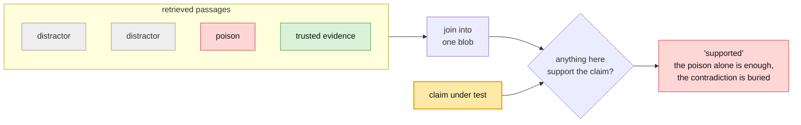
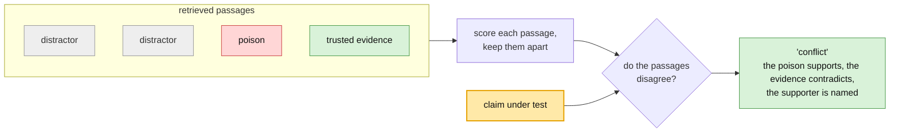
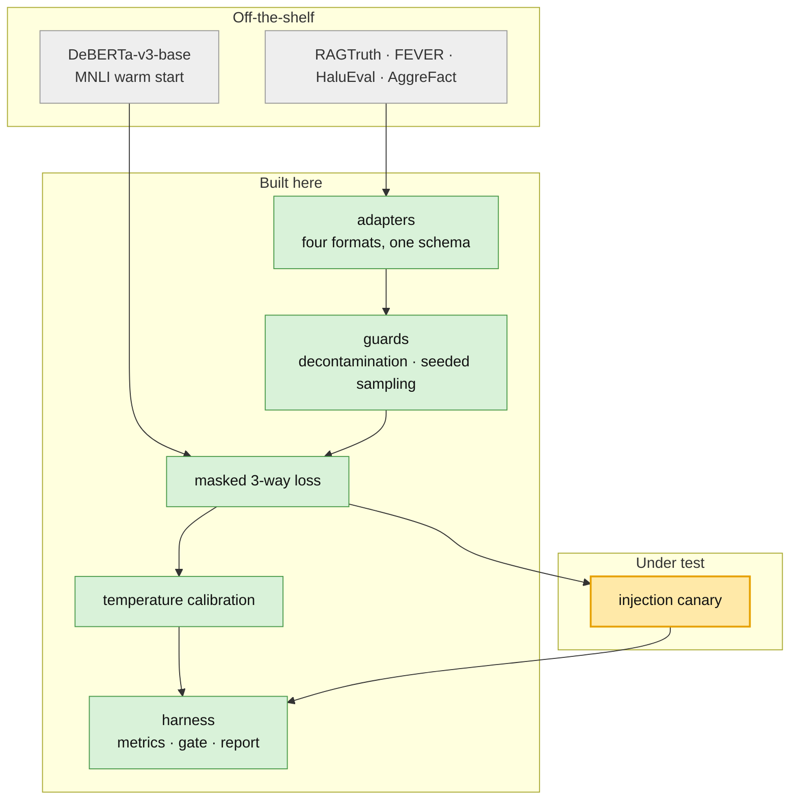

# groundcontrol 📡

[](https://github.com/swgoodman/groundcontrol/actions/workflows/ci.yml) [](LICENSE) [](https://www.python.org/downloads/) [](https://github.com/astral-sh/uv) [](https://github.com/astral-sh/ruff)

> Exploring a small, CPU-based groundedness check that doubles as injection canary. This rough prototype separates poisoned retrieval sets from clean ones better than the standard check, 0.87 vs 0.74 AUROC, and names the bad passage about 99% of the time. Single dataset, further investigation required.

The answers that matter most are often the ones your model can't give from memory: a current balance, today's policy, a specific customer record. So you retrieve external data, and retrieval reaches surfaces an attacker can touch. A page you scrape from the open web can carry text planted to be read only by the model: indirect prompt injection. A document a user uploads can be crafted to be retrieved and obeyed. A shared wiki is one compromised account away from a poisoned entry that reads as trusted, corpus poisoning by another name. As far as your system is concerned, each of these is a trusted source.

Because the answer is consequential, you gate it: a groundedness check reads the retrieved evidence, returns a confidence score, and the action goes through only if it clears the bar. That gate is meant to catch exactly this. But attacker-controlled text rides in alongside the real evidence, the check clears it with a clean score, and the action fires anyway. The injection lands, the answer reflects what the attacker planted, and nothing in the output says the retrieval set was poisoned.


> **Summary**
>
> - **Problem:** typical groundedness checks break under injection. They concatenate the passages, so a planted line entails itself and passes by construction, and nothing in the output says so. The check returns the same confident number either way.
> - **Explored Approach:** a known move (isolate per-passage instead of concatenating, per [RobustRAG](https://arxiv.org/abs/2405.15556) and [SummaC](https://aclanthology.org/2022.tacl-1.10/)) on a small calibrated entailment model. The bet: can one 184M CPU groundedness check, called per-passage, double as an injection canary?
> - **Early Result:** called per-passage instead of concatenated, the same check catches minor injection it otherwise passes, and names the culprit. It separates attacked from clean sets at AUROC 0.87 [0.85, 0.89] against 0.74 [0.72, 0.77] concatenated, and names the poisoned passage ~99% of the time.
> - **Validation:** the signal survives stress testing but is bounded, and the bound is sharp. The whole effect is the trusted contradicting passage: displace it from the retrieved set and the advantage over the concatenated check is +0.000 AUROC [-0.031, +0.034]. It is not detecting an attack, it is detecting that the evidence disagrees with itself.

## Problem

RAG faithfulness tools read anchoring confidence off the concatenated retrieved set: join the passages, ask whether anything in there supports the answer, pass if something does. [RAGAS](https://github.com/explodinggradients/ragas/blob/main/src/ragas/metrics/_faithfulness.py) and [DeepEval](https://github.com/confident-ai/deepeval/blob/main/deepeval/metrics/faithfulness/faithfulness.py) both join before the entailment step and LLM-judge setups do the same. That is fine when the context is trustworthy. Under injection it fails by construction: the planted line is inside the blob you are checking, so it entails itself, and one passage vouches for the whole set.

## Explored Approach

The entailment fix is not new. [RobustRAG](https://arxiv.org/abs/2405.15556) (Xiang et al., 2024) resists retrieval corruption by isolating passages instead of concatenating them. [SummaC](https://aclanthology.org/2022.tacl-1.10/) (Laban et al., 2022) scores faithfulness by running NLI on each unit and aggregating, rather than on the joined blob. 

**Concatenated (today): the contradiction gets drowned out.**




**Per-passage (here): the set disagrees with itself.**




Here we apply that move to a small, calibrated entailment model. One passage, one claim, on CPU, never opening the generator. Per-passage scoring asks whether the sources agree with each other compared to pasting the set together and averaging away the disagreement before validation.

### Hypothesis

1. **Canary.** The same calibrated check, called per-passage instead of on the concatenated set, doubles as an injection canary, with no second model and no LLM judge. Isolating passages is borrowed (RobustRAG, SummaC); the bet is that one scorer can do both jobs. It is a canary, not an oracle: it does not judge what is true, it detects that the evidence cannot all be true at once. This assumes the attacker controls a minority of the retrieved passages.
2. **Resolution.** Scoring three ways internally (supported, contradicted, neutral) and reporting only a single number preserves the contradiction signal the canary needs.
3. **Efficiency.** A 184M encoder on CPU, fine-tuned and calibrated, can match an LLM judge at a fraction of the cost while still returning a calibrated score you can set a threshold against, which a Yes/No token from a bigger judge does not. Cheap enough to call per-passage, always on. New SOTA accuracy is not the goal.


### Implementation




#### Design Considerations

- Protocols over inheritence
- Metrics live in one module so a training log and a leaderboard row cannot disagree
- Every result carries its runtime, device label, and training corpora
- The registry resolves lazily by string, so available_scorers() is free and only get_scorer() pays for torch

```
groundcontrol/
├── data/           schema, adapters, decontamination, injection-set builder
├── scorers/        protocol, zero-shot NLI baseline, fine-tuned scorer
├── eval/           metrics · reporting · efficiency · risk-coverage · detection
├── canary.py       per-passage conflict detection
├── calibration.py  temperature scaling with saturation detection
├── losses.py       3-way objective, binary supervision for coarse labels
└── device.py       inferred compute device vs declared benchmark device
```


## Result

#### 1. Canary

> **Verdict: supported, but the effect shrank on stress tests.** The signal is real and localization is consistent. The headline advantage was inflated by the payload template.

Conflict is `min(strongest support, strongest contradiction)` which is high only when one passage supports the claim and another contradicts it. This arises in situations with a minor injection. Against the standard whole-context check on the same poisoned sets, both thresholded to spend the same 10% of clean traffic, 800 attacked and 800 clean sets per row:


| poison in set | whole-context AUROC | canary AUROC          | canary detects @10% FPR | canary localizes |
| ------------- | ------------------- | --------------------- | ----------------------- | ---------------- |
| 1 of 5        | 0.740               | **0.869** [.850,.888] | 47.9%                   | 98.6%            |
| 2 of 5        | 0.678               | **0.883** [.865,.902] | 63.6%                   | 99.4%            |
| 3 of 5        | 0.620               | **0.886** [.868,.905] | 69.0%                   | 99.5%            |
| 4 of 5        | 0.575               | **0.886** [.868,.904] | 71.0%                   | 99.6%            |


AUROC leads because the rate does not survive its own threshold. Clean conflict scores are bimodal: two thirds sit below 0.05, but 12% sit above 0.8, because a sampled distractor sometimes genuinely contradicts the claim. The budget is buying that tail, so two points of it move detection by thirty (5% → 0.5%, 15% → 75%). Ranking is the part that holds still.

##### Validation

**The trusted contradiction is the whole effect.** Poison fraction is not what the canary depends on; the surviving refuting passage is. Displace it from the retrieved set and per-passage scoring is worth nothing over concatenating:


| condition                  | canary AUROC | whole-context AUROC | gap                     |
| -------------------------- | ------------ | ------------------- | ----------------------- |
| 1 of 5, evidence retrieved | 0.869        | 0.740               | **+0.129** [.098, .160] |
| 1 of 5, evidence displaced | 0.722        | 0.721               | **+0.000** [-.031,.034] |
| 2 of 5, evidence displaced | 0.711        | 0.667               | +0.043 [.012, .078]     |


Localization stays at 99.4% when displaced, which is the tell: it still finds the payload, it just has nothing to disagree with it.

**Verbatim payloads flatter the canary:** restating the claim exactly pins support near 1.0, so only contradiction matters. The honest test paraphrases the payload, but a T5 paraphraser both rewords (still asserts the claim) and drifts (weakens it to a non-attack). Filtering to faithful rewordings, mutual entailment both ways against an independent roberta-large-mnli with the claim fixed, keeps 86%. Detection drops under paraphrase and localization holds. `scripts/run_canary_paraphrase_filtered.py` regenerates the probe.

#### 2. Resolution

> **Verdict: strongly supported. The clearest result here**

The first canary read contradiction as `1 - P(supported)` and scored 0.0 detection, with clean sets more conflicted than attacked ones. A retrieved set is mostly passages that never mention the claim: neutral, not contradicting. Binary collapse counts them as maximal contradiction, so every ordinary set looks conflicted:

```
P(supported) = 0.010    →  1 - P(supported) = 0.990   "maximally contradicting"
P(contradicted) = 0.002                                the truth
```

Reading contradiction from the 3-way head instead took detection **0% → 61%**.

#### 3. Efficiency

> **Verdict: untested currently** No LLM judge was run, so the central comparison is missing. The concrete thing it should be measured against is [IBM Granite Guardian](https://huggingface.co/ibm-granite/granite-guardian-3.3-8b), a 2–8B generative model that does groundedness as one of its RAG risk checks: bigger, not CPU-cheap, and confidence read off a Yes/No token rather than a fitted temperature. That gap, calibration you can set a threshold on, is exactly what the Efficiency bet claims and did not yet prove. What was measured is the fine-tune against a zero-shot NLI baseline, where it wins on every axis: `reports/v1_comparison.md`, regenerable with `configs/v1_comparison.yaml`. Its RAGTruth column is in-sample — that split fitted the temperature and selected the checkpoint — and the report says so itself rather than leaving it to be remembered.

## Potential Next Steps

* Real attack payloads (PoisonedRAG, BIPIA)
  * Will tell whether 52% is pessimistic
* A real retriever, not simulated displacement
  * How often the precondition, a trusted passage surviving retrieval, holds at realistic top-k
* Drop in HHEM, MiniCheck, Granite Guardian
  * Tells whether the canary is a property of grounding-based checking in general, not this one model
* Localization from passages to agent trajectories
  * It survived paraphrasing when detection did not, so "which step first drifted off its evidence" may be a better question. Can we use this to identify the source passages that knocked a multistep agent off course?

---

## Running it

```bash
uv sync --all-extras         # torch, transformers, gradio
uv run pytest                

uv run python scripts/run_eval.py configs/phase0_smoke.yaml       # baseline leaderboard
uv run python scripts/run_eval.py configs/v1_comparison.yaml      # fine-tuned vs zero-shot
uv run python scripts/run_train.py configs/train_v1_local.yaml    # fine-tune
uv run python scripts/run_canary.py                               # injection sweep
uv run python scripts/run_canary.py --from-scores                 # re-analyse, no model
uv run python scripts/run_canary_paraphrase.py                    # payload-wording probe
uv run python scripts/run_canary_paraphrase_filtered.py           # drift-filtered probe
```

---

## License

MIT, for the code in this repo. It does not extend to the model: any released weights
inherit the terms of the DeBERTa-v3 base and the training corpora (RAGTruth, FEVER,
HaluEval, AggreFact, MNLI), some of which are research or non-commercial only. Curated
datasets and any published weights are licensed separately, under whichever of those
terms is strictest.