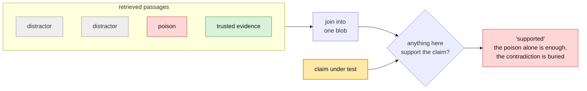
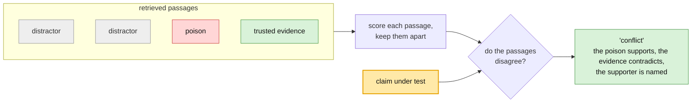
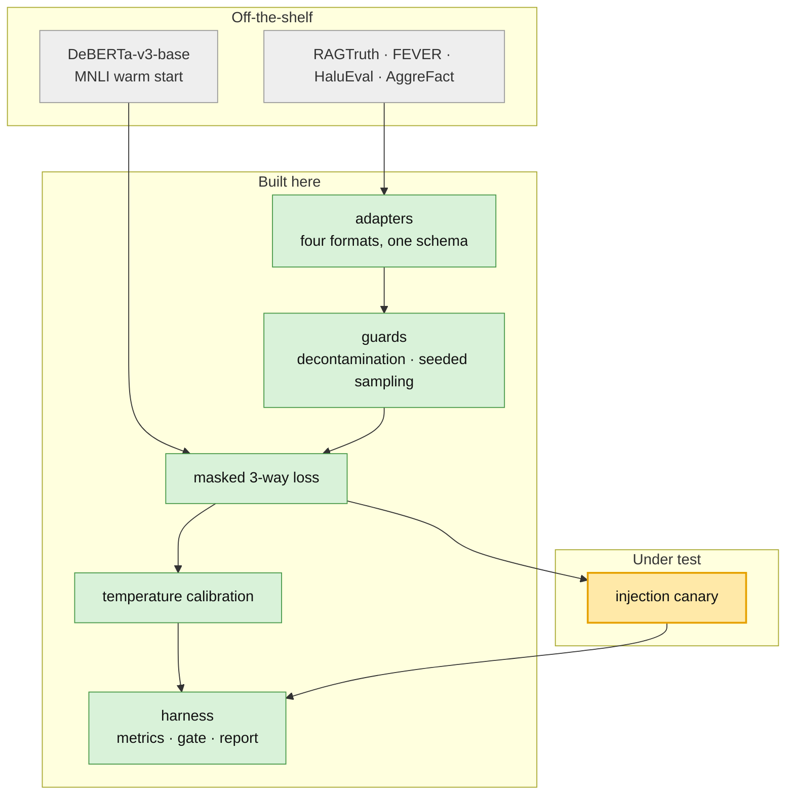

# groundcontrol 📡

As I work to complete my MAS-CS, I'm interested in exploring ways to make models

- safer (behaving as intended under adversarial pressure)
- more efficient (fewer resources to run)
- more accountable (answers you can trace back to a source)

groundcontrol explores improving safety through accountability, with a focus on detecting prompt injection and RAG poisoning. The idea is you don't need to recognize the injection attack. You need a fast read on whether the answer is anchored to evidence you trust, and a confidence score you can gate on before acting on the output. 

And can the same check that grounds an answer also catch an injection?

---

> **Summary**
>
> - **Problem:** typical groundedness checks break under injection. It concatenates the passages, so a planted line entails itself and passes by construction. Can we guard against this and validate grounding and injection at once?
> - **Solution Explored:** a known move (isolate per-passage instead of concatenating, per [RobustRAG](https://arxiv.org/abs/2405.15556) and [SummaC](https://aclanthology.org/2022.tacl-1.10/)) on a small calibrated entailment model. The bet: can one 184M CPU groundedness check, called per-passage, double as an injection canary?
> - **Early Result:** called per-passage instead of concatenated, the same check catches minor injection it otherwise passes, and names the culprit. 52–82% of synthetic injections caught vs 2–27% concatenated, poisoned passage named ~96% of the time.
> - **Validation:** the signal survives stress testing but is bounded. Once paraphrases are filtered to faithful rewordings, honest single-injection detection is 52% at a 2.7x edge over whole-context, not the raw probe's 45% / 1.9x, which had counted drifted paraphrases that no longer assert the claim. Detection also needs a trusted contradicting passage in the set, dropping to ~26% when that evidence is displaced.

---


## Problem

RAG faithfulness tools read anchoring confidence off the concatenated retrieved set: join the passages, ask whether anything in there supports the answer, pass if something does. [RAGAS](https://github.com/explodinggradients/ragas/blob/main/src/ragas/metrics/_faithfulness.py) and [DeepEval](https://github.com/confident-ai/deepeval/blob/main/deepeval/metrics/faithfulness/faithfulness.py) both join before the entailment step; LLM-judge setups do the same. That is fine when the context is trustworthy. Under injection it fails by construction: the planted line is inside the blob you are checking, so it entails itself, and one passage vouches for the whole set.

## Explored Solution

The entailment fix is not new. [RobustRAG](https://arxiv.org/abs/2405.15556) (Xiang et al., 2024) resists retrieval corruption by isolating passages instead of concatenating them. [SummaC](https://aclanthology.org/2022.tacl-1.10/) (Laban et al., 2022) scores faithfulness by running NLI on each unit and aggregating, rather than on the joined blob. 

**Concatenated (today): the contradiction gets drowned out.**




**Per-passage (here): the set disagrees with itself.**




Here we apply that move to a small, calibrated entailment model. One passage, one claim, on CPU, never opening the generator. Per-passage scoring asks whether the sources agree with each other compared to pasting the set together and averaging away the disagreement before validation.

### Hypothesis

1. **Canary.** The same calibrated check, called per-passage instead of on the concatenated set, doubles as an injection canary, with no second model and no LLM judge. Isolating passages is borrowed (RobustRAG, SummaC); the bet is that one scorer can do both jobs. It is a canary, not an oracle: it does not judge what is true, it detects that the evidence cannot all be true at once. This assumes the attacker controls a minority of the retrieved passages.
2. **Resolution.** Scoring three ways internally (supported, contradicted, neutral) and reporting only a single number preserves the contradiction signal the canary needs.
3. **Efficiency.** A 184M encoder on CPU, fine-tuned and calibrated, can match an LLM judge at a fraction of the cost while still returning a calibrated score you can set a threshold against, which a Yes/No token from a bigger judge does not. Cheap enough to call per-passage, always on. New SOTA accuracy is not the goal.


### Implementation




#### Design Considerations

- Protocols over inheritence
- Metrics live in one module so a training log and a leaderboard row cannot disagree
- Every result carries its runtime, device label, and training corpora
- The registry resolves lazily by string, so available_scorers() is free and only get_scorer() pays for torch

```
groundcontrol/
├── data/           schema, adapters, decontamination, injection-set builder
├── scorers/        protocol, zero-shot NLI baseline, fine-tuned scorer
├── eval/           metrics · reporting · efficiency · risk-coverage
├── canary.py       per-passage conflict detection
├── calibration.py  temperature scaling with saturation detection
├── losses.py       3-way objective, binary supervision for coarse labels
└── device.py       inferred compute device vs declared benchmark device
```


## Result

#### 1. Canary

> **Verdict: supported, but the effect shrank on stress tests.** The signal is real and localization is consistent. The headline advantage was inflated by the payload template.

Conflict is `min(strongest support, strongest contradiction)` which is high only when one passage supports the claim and another contradicts it. This arises in situations with a minor injection. Against the standard whole-context check on the same poisoned sets:


| poison in set | whole-context detects | canary detects | canary localizes |
| ------------- | --------------------- | -------------- | ---------------- |
| 1 of 5        | 1.7%                  | **60.8%**      | 97.5%            |
| 2 of 5        | 1.7%                  | **78.3%**      | 98.3%            |
| 3 of 5        | 0.0%                  | **80.0%**      | 98.3%            |
| 4 of 5        | 0.0%                  | **81.7%**      | 98.3%            |


The whole-context approach catches almost nothing while the canary catches 61 to 82% and names the passage ~98% of the time.

##### Validation

**Verbatim payloads flatter the canary:** restating the claim exactly pins support near 1.0, so only contradiction matters. The honest test paraphrases the payload, but a T5 paraphraser both rewords (still asserts the claim) and drifts (weakens it to a non-attack). Filtering to faithful rewordings, mutual entailment both ways against an independent roberta-large-mnli with the claim fixed, keeps 86%:


| payload (faithful)   | canary    | whole-context | edge     |
| -------------------- | --------- | ------------- | -------- |
| k=1, verbatim        | 63.5%     | 1.9%          | 33x      |
| k=1, **paraphrased** | **51.9%** | 19.2%         | **2.7x** |
| k=2, verbatim        | 78.8%     | 1.9%          | 41x      |
| k=2, **paraphrased** | **64.4%** | 19.2%         | **3.4x** |


So the honest single-injection number is **52% at a 2.7x edge**, not the raw probe's 45% / 1.9x. Localization barely moves (95.8% vs 97.5%).

#### 2. Resolution

> **Verdict: strongly supported. The clearest result here**

The first canary read contradiction as `1 - P(supported)` and scored 0.0 detection, with clean sets more conflicted than attacked ones. A retrieved set is mostly passages that never mention the claim: neutral, not contradicting. Binary collapse counts them as maximal contradiction, so every ordinary set looks conflicted:

```
P(supported) = 0.010    →  1 - P(supported) = 0.990   "maximally contradicting"
P(contradicted) = 0.002                                the truth
```

Reading contradiction from the 3-way head instead took detection **0% → 61%**.

#### 3. Efficiency

> **Verdict: untested currently** No LLM judge was run, so the central comparison is missing. The concrete thing it should bee measured against is [IBM Granite Guardian](https://huggingface.co/ibm-granite/granite-guardian-3.3-8b), a 2–8B generative model that does groundedness as one of its RAG risk checks: bigger, not CPU-cheap, and confidence read off a Yes/No token rather than a fitted temperature. That gap, calibration you can set a threshold on, is exactly what the Efficiency bet claims and did not yet prove. What was measured is the fine-tune against a zero-shot NLI baseline, where it wins on every axis.


|                    | LLM-AggreFact |            | RAGTruth (in-domain) |            |
| ------------------ | ------------- | ---------- | -------------------- | ---------- |
|                    | zero-shot     | fine-tuned | zero-shot            | fine-tuned |
| balanced accuracy  | 0.591         | **0.695**  | 0.575                | **0.807**  |
| F1 (not-supported) | 0.422         | **0.508**  | 0.494                | **0.740**  |
| ECE (lower better) | 0.474         | **0.181**  | 0.275                | **0.019**  |
| gate lift          | 0.45          | **0.63**   | 0.37                 | **0.84**   |


## Potential Next Steps

* Real attack payloads (PoisonedRAG, BIPIA)
  * Will tell whether 52% is pessimistic
* A real retriever, not simulated displacement
  * How often the precondition, a trusted passage surviving retrieval, holds at realistic top-k
* Drop in HHEM, MiniCheck, Granite Guardian
  * Tells whether the canary is a property of grounding-based checking in general, not this one model
* Localization from passages to agent trajectories
  * It survived paraphrasing when detection did not, so "which step first drifted off its evidence" may be a better question. Can we use this to identify the source passages that knocked a multistep agent off course?

---

## Running it

```bash
uv sync --all-extras         # torch, transformers, gradio
uv run pytest                

uv run python scripts/run_eval.py configs/phase0_smoke.yaml       # baseline leaderboard
uv run python scripts/run_train.py configs/train_v1_local.yaml    # fine-tune
uv run python scripts/run_canary.py                               # injection sweep
uv run python scripts/run_canary_paraphrase.py                    # payload-wording probe
uv run python scripts/run_canary_paraphrase_filtered.py           # drift-filtered probe
```

---

## License

MIT, for the code in this repo. It does not extend to the model: any released weights
inherit the terms of the DeBERTa-v3 base and the training corpora (RAGTruth, FEVER,
HaluEval, AggreFact, MNLI), some of which are research or non-commercial only. Curated
datasets and any published weights are licensed separately, under whichever of those
terms is strictest.